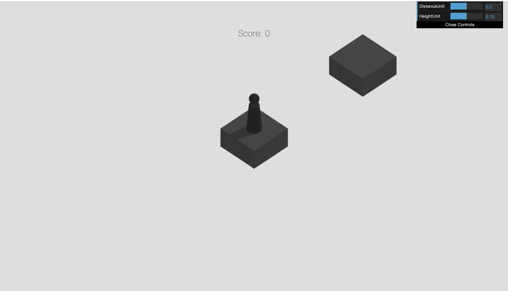
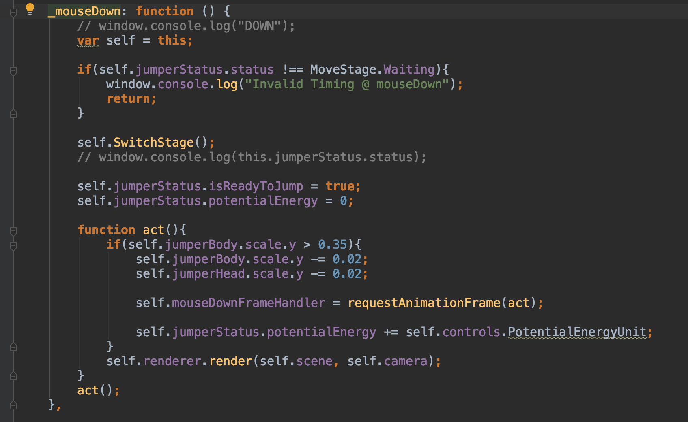
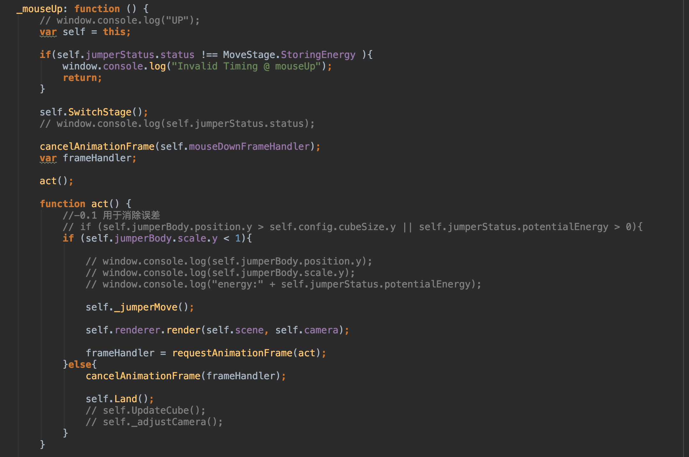
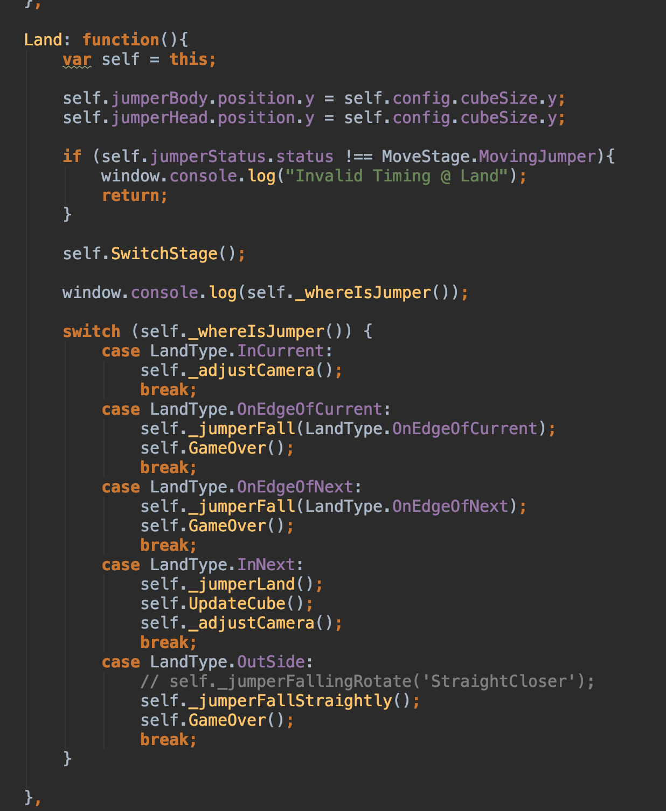
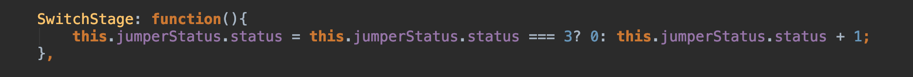
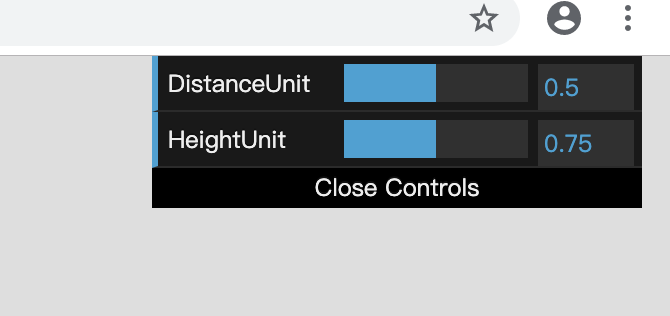

## 网页版跳一跳

### 1. 游戏界面展示


### 2. 主体框架描述

- 注册`mouseDown 响应函数`

  

  该函数实现对鼠标按压事件的响应，在函数中实现棋子蓄力，并在蓄力过程中对棋子模型进行缩放，展现蓄力效果。

  - 蓄力过程逐渐正向增长关键变量 `potentialEnergy`，该变量将在之后的棋子运动过程中作为运动的计量单位，具体表征运动中的速度。

  - `potentialEnergy`将在运动过程中不断被消耗，并在数值上不断减少固定值`potentialEnergyUnit`，最终在运动结束时减少为原来的 -1 倍。

  - 在该减少的过程中，`potentialEnergy`作为速度的表征值，绝对值先减少后增减，符号由正变负，从而模拟了上抛运动中的速度变化状态，最终实现了简单的物理运动效果。

    

- 注册`mouseUp` 响应函数

  

  该函数实现对鼠标放开事件的响应，由于输入设备的物理限制，在游戏的生命周期中，该函数总是在`mouseDown` 函数之后被调用

  - 该函数会在执行过程中调用`_jumperMove()`这一具体动作执行性函数，并在判断棋子运动已结束后调用`Land（）`函数，执行后续动作

  

- `Land()`函数

  

  该函数首先通过`_whereIsJumper()`函数对棋子当前位置状态进行判断，该判断将返回五种可能枚举值，对应棋子五种可能的落点状态，分别为：**起跳方块内部**，**起跳方块边缘**，**目标方块边缘**，**目标方块内部**，**所有方块外部**。

  五种状态中，只有**目标方块内部**代表本次跳跃成功，将会进行加分并进入下一阶段。而**起跳方块内部**什么都不会做，包括创建新的方块，其余三种均视为游戏失败，调用`GameOver()`函数进入游戏结算阶段。

  

- 状态模式的应用

  游戏的执行状态由枚举量 `MoveStage` 标记

  ```javascript
  var MoveStage = {
      Waiting: 0,
      StoringEnergy: 1,
      MovingJumper: 2,
      MovingCamera: 3,
  };
  ```

  该状态量仅可由函数 `SwitchStage()`函数进行按序改变

  

  而该函数的调用被严格的控制在各个游戏时期切换节点上，从而限制了如棋子还在空中就开始第二次跳跃、或摄像头还没有对准棋子的新位置，棋子就已经再次跳跃等时序问题。


### 3. 附加功能实现

 	1. 跨平台，本项目支持各平台的浏览器访问。通过手机浏览游玩时会自动将原本的鼠标按压响应函数改为屏幕点击响应函数。
 	2. 调节跳跃灵敏度



​		如上图所示，游戏界面右上角设置有该控制面板。

​		玩家可实时对上述两变量 `DistanceUnit` 与`HeightUnit` 进行调节，以调整棋子在跳跃过程中的距离与高度	灵敏度。

​		通过调节，玩家可以找到自己适应的跳跃粒度，改善游戏体验。


### 4. 附录

​		项目访问链接：https://chosendebugger.github.io/Jump/